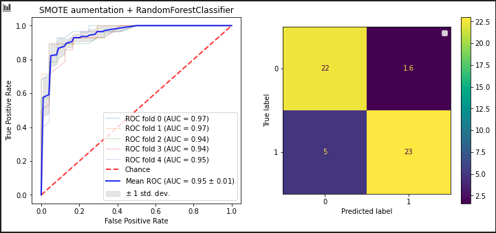

# Heart Failure Prediction ❤️

This work consists of the analysis of different estimators for the detection of cardiac insufficiency.

## Best model

The best results were obtained with a Random Forest using the SMOTE algorithm for data augmentation and the model was trained through k-flod cross validation with k = 5

 
   </img>
   
Figure 1: Results of the experiment

## Reference

* [Sklearn](https://scikit-learn.org/)
* [kaggle Dataset](https://www.kaggle.com/andrewmvd/heart-failure-clinical-data)